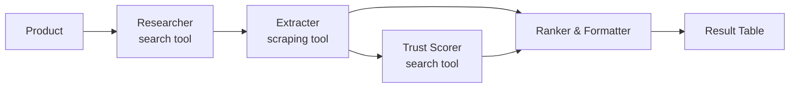

# PriceScout

A multi-agent LangChain pipeline that finds and compares product prices across Moroccan online stores, ranking sellers by price and trust score.

## How it works

Four agents run in sequence:

1. **Researcher** — searches (via Tavily) for pages selling the product, targeting Moroccan stores.
2. **Extracter** — scrapes those pages and extracts price, stock, and seller for each listing.
3. **Trust Scorer** — searches for reviews/complaints about each seller and assigns a trust score.
4. **Ranker & Formatter** — ranks listings by price + trust score and formats the final result table.



*(editable source: [demo.excalidraw](demo.excalidraw) — open it with the [Excalidraw](https://excalidraw.com) editor or a compatible VS Code extension; GitHub can't render `.excalidraw` files inline)*

## Setup

```bash
python -m venv langagent
source langagent/bin/activate
pip install -r requirements.txt
```

Create a `.env` file with:

```
OPENAI_API_KEY=your-key
TAVILY_API_KEY=your-key
```

## Usage

Run the pipeline from the command line:

```bash
python main.py
```

Or launch the Streamlit app:

```bash
streamlit run app.py
```

## Project structure

```
src/
  agents/    # agent + chain definitions (agents.py)
  tools/     # web_search and scrape_url tools (tools.py)
  pipelines/ # orchestrates the 4 agents end-to-end (pipelines.py)
main.py      # CLI entry point
app.py       # Streamlit UI
```
